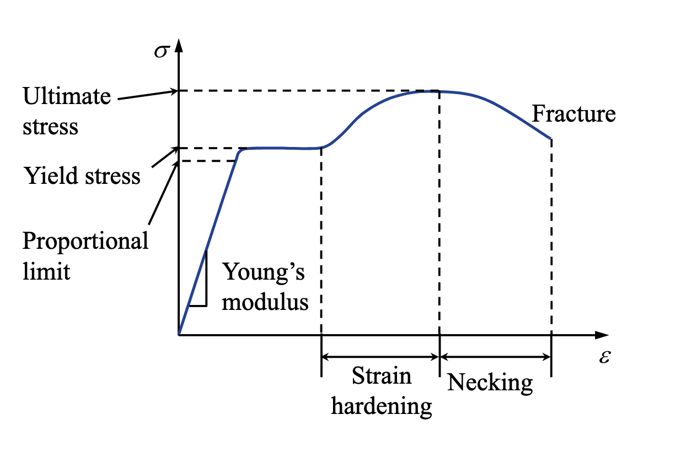

# Chapter 1 Preliminary Concepts
> Last updated: 26 Apr 2026
# 1.3 Stress and Strain
## 1.3.1 Stress
**Surface traction** is defined as the internal force per unit area or the force intensity acting on the cut plane with normal $\boldsymbol{n}$ acting on a specific point $P$:

$$
\boldsymbol{t}^{(\boldsymbol{n})}=\lim _{\Delta A \rightarrow 0} \frac{\Delta \boldsymbol{F}}{\Delta A} = t^{(\boldsymbol{n})}_i \boldsymbol{e}_i
$$

Although $\boldsymbol{t}^{(\boldsymbol{n})}$ at $P$ depends on $\boldsymbol{n}$, the state of stress at $P$ can be represented by the stress tensor $\boldsymbol{\sigma}$:

$$
\boldsymbol{\sigma}=\sigma_{i j} \boldsymbol{e}_i \otimes \boldsymbol{e}_j
$$

with the sign convention as

$$
\text{sign of } \sigma_{i j}= (\text{sign of plane }i) \cdot (\text{sign of force } j)
$$

With **the balance of angular momentum**, the stress tensor is symmetric, i.e., $\sigma_{i j}=\sigma_{j i}$.
> We can also express the stress tensor using **the Voigt notation** as $\boldsymbol{\sigma}=\left[\sigma_{11}, \sigma_{22}, \sigma_{33}, \sigma_{12}, \sigma_{23}, \sigma_{13}\right]^{\top}$.
The **Cauchy's Lemma** states that the surface traction $\boldsymbol{t}^{(\boldsymbol{n})}$ can be obatined with $\boldsymbol{\sigma}$ as

$$
\boldsymbol{t}^{(\boldsymbol{n})}=\boldsymbol{n}\cdot \boldsymbol{\sigma} 
$$

which can be further decomposed into the normal and shear components as

$$
\boldsymbol{t}^{(\boldsymbol{n})}=\sigma_{n} \boldsymbol{n}+\boldsymbol{\tau}^{(\boldsymbol{n})}
$$

where $\sigma_{n}=\boldsymbol{t}^{(\boldsymbol{n})}\cdot\boldsymbol{n}=\boldsymbol{n} \cdot \boldsymbol{\sigma} \cdot \boldsymbol{n}$ is the **normal stress** and $\boldsymbol{\tau}^{(\boldsymbol{n})}=\boldsymbol{t}^{(\boldsymbol{n})}-\sigma_{n} \boldsymbol{n}$ is the **shear stress**.
The stress tensor can be decomposed into **hydrostatic pressure**/**mean stress** (volume change) and **deviatoric stress** (shape change) as:

$$
\boldsymbol{\sigma} = \sigma_m\boldsymbol{I} + \boldsymbol{s} =\underbrace{\frac{1}{3} \operatorname{tr}(\boldsymbol{\sigma}) \boldsymbol{I}}_{\text {hydrostatic pressure}} + \underbrace{\left(\boldsymbol{\sigma}-\frac{1}{3} \operatorname{tr}(\boldsymbol{\sigma}) \boldsymbol{I}\right)}_{\boldsymbol{s}\text{ deviatoric stress}}
$$

with two interesting properties:
1. the frame invariant property of the hydrostatic pressure
2. the trace-free property of the deviatoric stress
The deviatoric stress $\boldsymbol{s}$ can also be obatined via:

$$
\boldsymbol{s} = \mathbb{I}_{\text{dev}} : \boldsymbol{\sigma}=(\mathbb{I}-\frac{1}{3} \boldsymbol{I} \otimes \boldsymbol{I}) : \boldsymbol{\sigma}
$$

where $\mathbb{I}_{\text{dev}}$ is the unit deviatoric tensor of rank-4. $\mathbb{I}$ is the unit sysmmetric fourth-order tensor with components $I_{i j k l}=\frac{1}{2}\left(\delta_{i k} \delta_{j l}+\delta_{i l} \delta_{j k}\right)$. $\mathbb{I}_{\text{dev}}$ has two important properties:
1. $\mathbb{I}_{\text{dev}} : \boldsymbol{I} = \boldsymbol{0}$
2. $\mathbb{I}_{\text{dev}} : \boldsymbol{\sigma} = \boldsymbol{s}$
For each point, there are three mutually orthogonal planes with **only normal stresses** that attains an exremum, which are called **principal planes**. These stresses are called **principal stresses**, denoted as $\sigma_1$, $\sigma_2$, and $\sigma_3$ with the convention $\sigma_1 \geq \sigma_2 \geq \sigma_3$. The corresponding normal directions are called **principal directions**. The principal stresses can be obtained by solving the following eigenvalue problem:

$$
\boldsymbol{\sigma} \cdot \boldsymbol{n} = \sigma_{n} \boldsymbol{n}\Rightarrow (\boldsymbol{\sigma} - \sigma_{n} \boldsymbol{I}) \cdot \boldsymbol{n} = \boldsymbol{0}
$$

By setting $\operatorname{det}(\boldsymbol{\sigma} - \sigma_{n} \boldsymbol{I}) = 0$, we can obtain the three principal stresses $\sigma_1$, $\sigma_2$, and $\sigma_3$ as the roots of the characteristic polynomial:

$$
\sigma_{n}^3 - I_1 \sigma_{n}^2 + I_2 \sigma_{n} - I_3 = 0
$$

where $I_1 = \operatorname{tr}(\boldsymbol{\sigma})$, $I_2 = \begin{vmatrix} \sigma_{11} & \sigma_{12} \\ \sigma_{21} & \sigma_{22} \end{vmatrix} + \begin{vmatrix} \sigma_{22} & \sigma_{23} \\ \sigma_{32} & \sigma_{33} \end{vmatrix} + \begin{vmatrix} \sigma_{11} & \sigma_{13} \\ \sigma_{31} & \sigma_{33} \end{vmatrix}$, and $I_3 = \operatorname{det}(\boldsymbol{\sigma})$ are the three invariants of the stress tensor. The principal directions can be obtained by substituting each principal stress back into the eigenvalue problem.
> $I_2$ can also be expressed as $I_2 = \frac{1}{2} \left( \operatorname{tr}(\boldsymbol{\sigma})^2 - \operatorname{tr}(\boldsymbol{\sigma}^2) \right)$.
The principal planes are mutually **orthogonal**.
## 1.3.2 Strain
Under the infinitesimal deformation assumption, the strain tensor $\boldsymbol{\varepsilon}$ is defined as:

$$
\boldsymbol{\varepsilon} = \varepsilon_{i j} \boldsymbol{e}_i \otimes \boldsymbol{e}_j = \frac{1}{2} \left( \nabla \boldsymbol{u} + (\nabla \boldsymbol{u})^{\top} \right)
$$

with the components as $\varepsilon_{i j} = \frac{1}{2} (u_{i,j} + u_{j,i})$. The strain tensor is also symmetric, i.e., $\varepsilon_{i j} = \varepsilon_{j i}$.
> We can also express the strain tensor using **the Voigt notation** as $\boldsymbol{\varepsilon}=\left[\varepsilon_{11}, \varepsilon_{22}, \varepsilon_{33}, \gamma_{12}, \gamma_{23}, \gamma_{13}\right]^{\top}$, where $\gamma_{i j} = 2 \varepsilon_{i j}$ for $i \neq j$ is the **engineering shear strain**.
The Cauchy's Lemma, decomposition, and principal directions/strains for the strain tensor are similar to those for the stress tensor. For example, the volumetric strain is defined as $\varepsilon_v = \varepsilon_{kk}$ and the deviatoric strain can be obtained via $\boldsymbol{e} = \mathbb{I}_{\text{dev}} : \boldsymbol{\varepsilon}$.   

## 1.3.3 Stress-Strain Relationship
<!--  -->
<figure style="text-align: center;">
  
  <figcaption>Stress–strain diagram for a typical ductile material in tension</figcaption>
</figure>
The stress-strain relationship for a general linear elastic material can be expressed as:

$$
\boldsymbol{\sigma} = \mathbb{D} : \boldsymbol{\varepsilon}, \quad \sigma_{i j} = D_{i j k l} \varepsilon_{k l}
$$

where $\mathbb{D}$ is the rank-4 elasticity tensor that **must be symmetric**. The total number of components of $\mathbb{D}$ is **81** in 3D, but due to the symmetries of the stress and strain tensors, the number of independent components reduces to **21**. Besides, for different material symmetries, we have:

| Material Symmetry | Number of Independent Components |
| --- | --- |
| anisotropic | 21 |
| orthotropic | 9 |
| transversely isotropic | 5 |
| isotropic | 2 |
The elasticity tensor $\mathbb{D}$ for isotropic materials can be expressed as:

$$
\mathbb{D} = \lambda \boldsymbol{I} \otimes \boldsymbol{I} + 2 \mu \mathbb{I},\quad D_{i j k l} = \lambda \delta_{i j} \delta_{k l} + \mu (\delta_{i k} \delta_{j l} + \delta_{i l} \delta_{j k})
$$

where $\lambda$ and $\mu$ are the **Lamé parameters**. $\mu$ is also called the **shear modulus**. The Lamé parameters can be related to the nominal engineering constants (Young's modulus $E$ and Poisson's ratio $\nu$) as:

$$
\lambda = \frac{E \nu}{(1+\nu)(1-2 \nu)}, \quad \mu = \frac{E}{2(1+\nu)}
$$
> More transformations can be found at [Wikipedia](https://en.wikipedia.org/wiki/Elastic_modulus#Further_reading).
Besides, $\mathbb{D}$ for isotropic materials can also be decomposed into the hydrostatic and deviatoric parts as:

$$
\mathbb{D} = (\lambda + \frac{2}{3} \mu) \boldsymbol{I} \otimes \boldsymbol{I} + 2 \mu \mathbb{I}_{\text{dev}}
$$

which can be used to decompose the stress-strain relationship into the volumetric and deviatoric parts as:

$$
\boldsymbol{\sigma}= \underbrace{(\lambda + \frac{2}{3} \mu) \operatorname{tr}(\boldsymbol{\varepsilon}) \boldsymbol{I}}_{\text {volumetric part}} + \underbrace{2 \mu \mathbb{I}_{\text{dev}} : \boldsymbol{\varepsilon}}_{\text {deviatoric part}} = K \varepsilon_v \boldsymbol{I} + 2 \mu \boldsymbol{e}
$$

where $K = \lambda + \frac{2}{3} \mu$ is the **bulk modulus**. Then we can get $\sigma_m = K \varepsilon_v$.
For convenience, we can also express the stress-strain relationship in the Voigt notation as:

$$
\left[\begin{array}{c}\sigma_{11} \\ \sigma_{22} \\ \sigma_{33} \\ \sigma_{12} \\ \sigma_{23} \\ \sigma_{13}\end{array}\right] = \frac{E}{(1+\nu)(1-2 \nu)} \left[\begin{array}{cccccc}
1-\nu & \nu & \nu & 0 & 0 & 0 \\
\nu & 1-\nu & \nu & 0 & 0 & 0 \\
\nu & \nu & 1-\nu & 0 & 0 & 0 \\
0 & 0 & 0 & \frac{1-2 \nu}{2} & 0 & 0 \\
0 & 0 & 0 & 0 & \frac{1-2 \nu}{2} & 0 \\
0 & 0 & 0 & 0 & 0 & \frac{1-2 \nu}{2}
\end{array}\right] \left[\begin{array}{c}\varepsilon_{11} \\ \varepsilon_{22} \\ \varepsilon_{33} \\ \gamma_{12} \\ \gamma_{23} \\ \gamma_{13}\end{array}\right]
$$

For plate-like structures, we can also use the **plane stress** or **plane strain** assumptions to further simplify the stress-strain relationship. For example, for plane stress, we have $\sigma_{13} = \sigma_{23} = \sigma_{33} = 0$ through the thickness, and the stress-strain relationship can be simplified as:

$$
\left[\begin{array}{c}\sigma_{11} \\ \sigma_{22} \\ \sigma_{12}\end{array}\right] = \frac{E}{1-\nu^2} \left[\begin{array}{ccc}
1 & \nu & 0 \\
\nu & 1 & 0 \\
0 & 0 & \frac{1-\nu}{2}
\end{array}\right] \left[\begin{array}{c}\varepsilon_{11} \\ \varepsilon_{22} \\ \gamma_{12}\end{array}\right]
$$

The out-of-plane strain is usually not zero, and can be computed as $\varepsilon_{33} = -\frac{\nu}{E} (\sigma_{11} + \sigma_{22})$. For plane strain, we have $u_3 = 0$ for all points, thus $\varepsilon_{13} = \varepsilon_{23} = \varepsilon_{33} = 0$. The stress-strain relationship can be simplified as:

$$
\left[\begin{array}{c}\sigma_{11} \\ \sigma_{22} \\ \sigma_{12}\end{array}\right] = \frac{E}{(1+\nu)(1-2 \nu)} \left[\begin{array}{ccc}
1-\nu & \nu & 0 \\
\nu & 1-\nu & 0 \\
0 & 0 & \frac{1-2 \nu}{2}
\end{array}\right] \left[\begin{array}{c}\varepsilon_{11} \\ \varepsilon_{22} \\ \gamma_{12}\end{array}\right]
$$

The out-of-plane stress is usually not zero, and can be computed as $\sigma_{33} = \frac{E\nu}{(1+\nu)(1-2 \nu)} (\varepsilon_{11} + \varepsilon_{22})$.