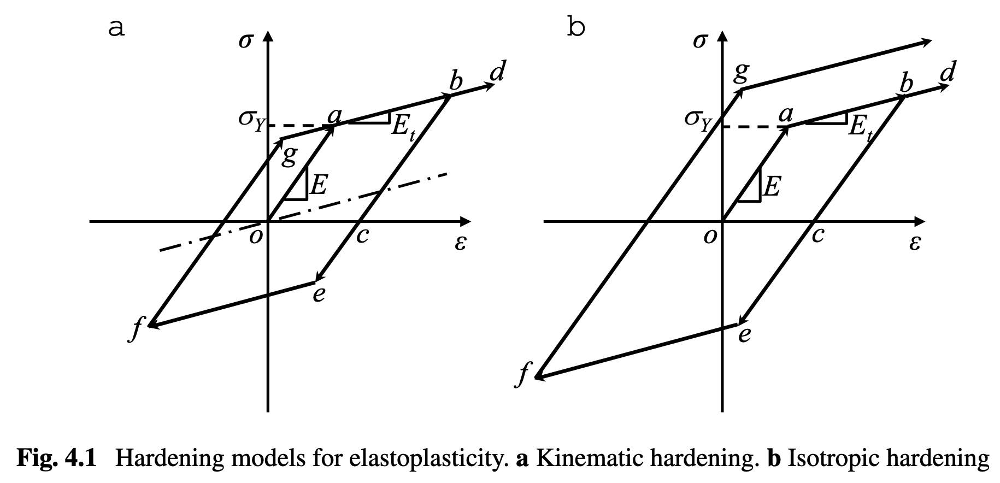

# Chapter 4 Element Analysis for Elastoplastic Problems

> Last updated: 16 Aug 2026 

## 4.1 Introduction

The *hypoelasticity* constitutive relation is given in terms of the rate of stress and strain, where the **rate** means an **increment** in static analysis.

The stress can only be calculated by integrating the stress rate over the past load history. Thus, stress calculation is history- or path-dependent. 

The plastic deformation of **metals** normally occurs at **0.2%** strain, which typically satisfies small strain conditions.

## 4.2 One-Dimensional Elastoplasticity

### 4.2.1 Elastoplastic Material Behavior

<figure style="text-align: center;">
  
  <figcaption>Hardening models for elastoplasticity. a. Kinematic hardening. b. Isotropic hardening</figcaption>
</figure>

* Elastic modulus $E$
* Yield point $a$
* Tangent modulus $E_t$
* Unloading $b-c$ with slope $E$
* Permanent plastic strain at point $c$
* Reloading $c-d$ with a new yield stress $b$
* Stress increases with a slope $E_t$ again after point $d$

In elastoplastic material, the **yield stress** changes due to **the strain-hardening effect**. 

Two of the most common hardening models are **kinematic hardening** and **isotropic hardening**.

The **kinematic hardening model** assumes that the elastic range (twice the initial yield stress) remains constant, and the center of the elastic range moves along the dashed line through the origin. 
 
The **isotropic hardening model** assumes that the magnitude of yield stress for the reverse loading is equal to that of the previous yield stress, and the elastic range grows.

The plastic strain **can only increase** as it is an accumulation of plastic deformation.

The plastic modulus $H$ is defined as the slope of the strain-hardening portion of the stress-strain curve after removing the elastic strain component:

$$
H = \frac{\Delta \sigma}{\Delta \varepsilon_p}
$$

Thus, the stress increment **during the plastic phase** can be written as:

$$
\Delta\sigma = E \Delta\varepsilon_e = H \Delta\varepsilon_p = E_t \Delta\varepsilon
$$

With the decomposition of the total strain increment $\Delta\varepsilon = \Delta\varepsilon_e + \Delta\varepsilon_p$, we can obtain:

$$
H = \frac{E E_t}{E - E_t},\quad E_t = \frac{EH}{E+H} = E(1 - \frac{E}{E+H})
$$

and the plastic strain increment can be expressed as:

$$
\Delta\varepsilon_p = \frac{E}{H} \Delta\varepsilon_e = \frac{E}{H} (\Delta\varepsilon - \Delta\varepsilon_p) \Rightarrow \Delta\varepsilon_p = \frac{1}{1+H/E} \Delta\varepsilon
$$

### 4.2.2 Finite Element Formulation for Elastoplasticity

~

### 4.2.3 Determination of Stress State

#### Isotropic hardening model

Assume that we know the strain increment $\Delta\varepsilon$ and the plastic strain $\varepsilon_p^{n}$ and stress $\sigma^{n}$

1. Compute the **current yield stress**: $\sigma_y^{n} = \sigma_y^0 + H \varepsilon_p^{n}$

    $\Downarrow$

2. **Elastic predictor**: $\sigma^{\text{tr}} = \sigma^{n} + \Delta\sigma^{\text{tr}} = \sigma^{n} + E \Delta\varepsilon$

    $\Downarrow$

3. Check **yield status**: $f^{\text{tr}} = |\sigma^{\text{tr}}| - \sigma_y^{n}$

    $\Downarrow$

4. **Plastic Corrector**: $\sigma^{n+1} = \sigma^{\text{tr}} - \text{sgn}(\sigma^{\text{tr}}) E \Delta\varepsilon_p$

    $\Downarrow$

5. **Plastic consistency condition**: $f^{n+1} = |\sigma^{n+1}| - \sigma_y^{n+1} = 0$

    With $\sigma_y^{n+1} = \sigma_y^n + H \Delta\varepsilon_p$ and the expression of $\sigma^{n+1}$, we can obtain the plastic strain increment $\Delta\varepsilon_p = \frac{|\sigma^{\text{tr}}| - \sigma_y^n}{E + H} = \frac{f^{\text{tr}}}{E + H}$.

    However, if a nonlinear hardening model is used, the plastic strain increment $\Delta\varepsilon_p$ is typically **solved iteratively**.

    $\Downarrow$

6. **Algorithm tangent stiffness**
   
   * **Algorithmic tangent modulus**: tangent modulus of the state determination algorithm $\rightarrow D^{\text{alg}}=\frac{\mathrm d\Delta\sigma}{\mathrm d\Delta\varepsilon}=
      \begin{cases}
      E, & \text{Elastic phase},\\[4pt]
      E_t, & \text{Plastic phase}.
      \end{cases}$

   * **Continuum tangent modulus**: slope of the stress-strain curve

-----

#### Kinematic hardening model

The elastic range in the kinematic hardening model is constant, and the center of the elastic range moves parallel to the hardening curve, where the "shifted stress" is defined as $\eta = \sigma - \alpha$, and $\alpha$ is the **back stress**. 

Assume that we know the strain increment $\Delta\varepsilon$, stress $\sigma^{n}$, and back stress $\alpha^{n}$ at loading step $n$.

Step 1. **Elastic predictor**: 
   

$$
\begin{align*}
\sigma^{\text{tr}} &= \sigma^{n} + \Delta\sigma^{\text{tr}} = \sigma^{n} + E \Delta\varepsilon\\
\eta^{\text{tr}} &= \sigma^{\text{tr}} - \alpha^{\text{tr}} = \sigma^{\text{tr}} - \alpha^{n}
\end{align*}
$$

Step 2. Check **yield status**: 
   
$$
f^{\text{tr}} = |\eta^{\text{tr}}| - \sigma_y^0
$$

Step 3. **Plastic corrector**: 

$$\begin{align*}
\sigma^{n+1} &= \sigma^{\text{tr}} - \text{sgn}(\eta^{\text{tr}}) E     \Delta\varepsilon_p\\
\alpha^{n+1} &= \alpha^{n} + \text{sgn}  (\eta^{\text{tr}}) H \Delta\varepsilon_p
\end{align*}
$$

which follows a similar procedure as the isotropic hardening model, while the back stress $\alpha$ can be negative or positive depending on the loading history.

Step 4. **Plastic consistency condition**: $f^{n+1} = |\eta^{n+1}| - \sigma_y^0 = 0$
   
with the plastic strain increment $\Delta\varepsilon_p = \frac{f^{\text{tr}}}{E + H}$.

-----

#### Combined isotropic/kinematic hardening model

Many practical materials, such as **polycrystalline metals**, show a combined effect of isotropic and kinematic hardening.

The yield stress initially increases due to plastic hardening, but it decreases when the direction of strain changes, which is due to the **dislocation** and is called the **Bauschinger effect**.

To model this combined effect, a new parameter $\beta$ between 0 and 1 is introduced to interpolate between the isotropic and kinematic hardening models:

$$
\begin{align*}
&\sigma_y^{n+1} = \sigma_y^n + (1-\beta)H\Delta\varepsilon_p\\ 
&\alpha^{n+1} = \alpha^n + \text{sgn}(\eta^{\text{tr}}) \beta H \Delta\varepsilon_p,
\end{align*}
$$

when $\beta = 0$, the model reduces to the isotropic hardening model, and when $\beta = 1$, it reduces to the kinematic hardening model.
