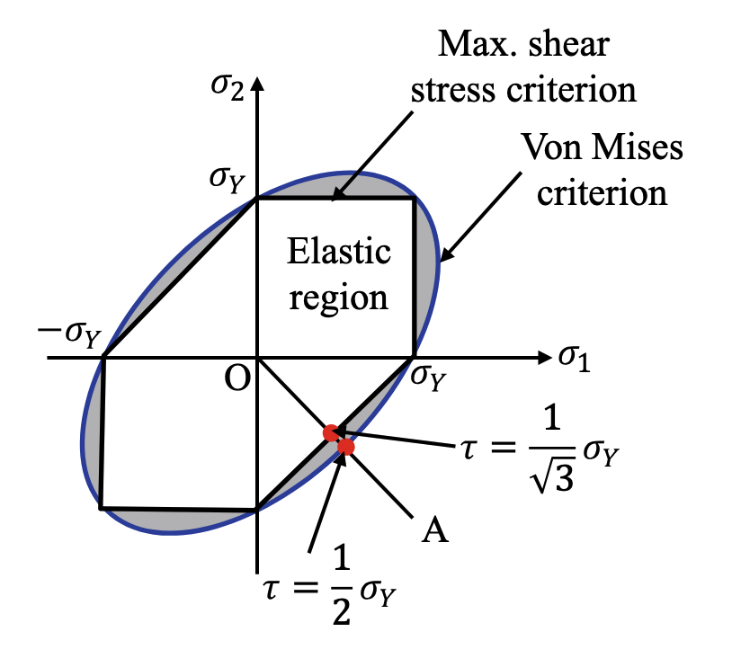
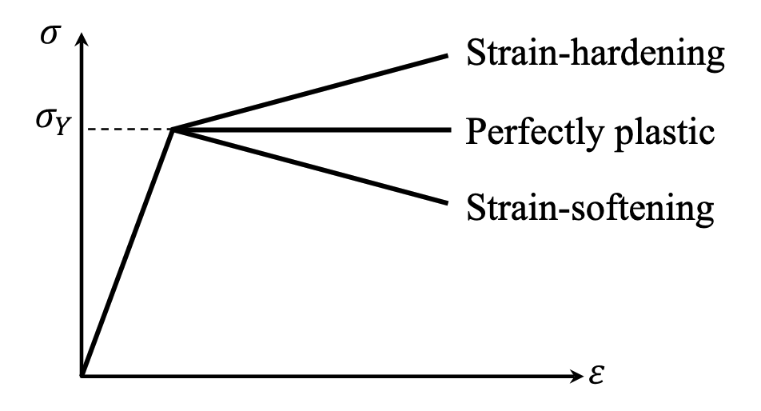
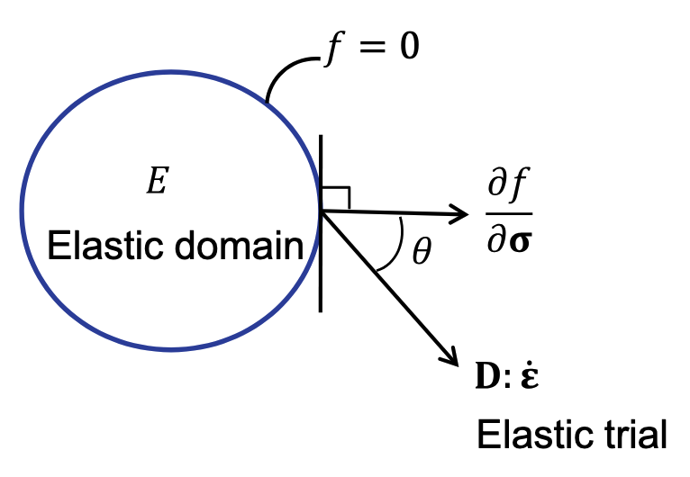
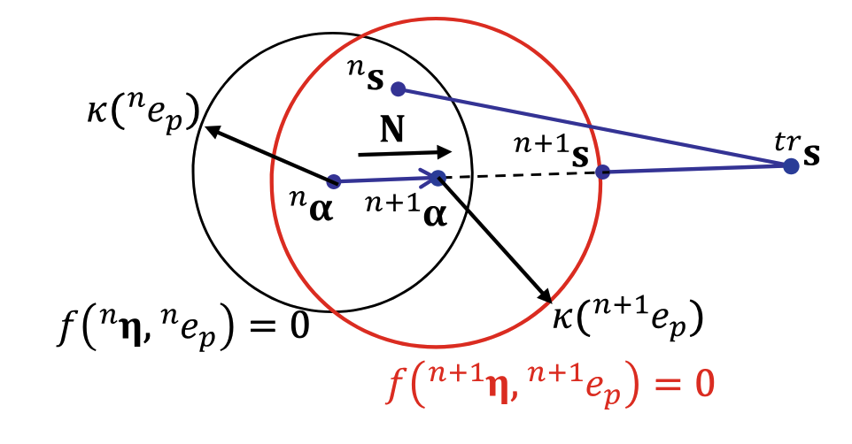

# Chapter 4 Element Analysis for Elastoplastic Problems

> Last updated: 16 Aug 2026 

## 4.3 Multi-dimensional Elastoplasticity

### 4.3.1 Yield Functions and Yield Criteria

#### Maximum shear stress criterion (Tresca criterion)

The **maximum shear stress** can be defined with the three **principal stresses** $\sigma_1\geq\sigma_2\geq\sigma_3$ as follows:

$$
\tau_{\text{max}} = \frac{\sigma_1 - \sigma_3}{2}
$$

This criterion assumes that material failure occurs when $\tau_{\text{max}}$ is equal to the shear stress in a tensile specimen at yield (i.e., $\sigma_{1} = \sigma_y$ and $\sigma_{2}=\sigma_{3} = 0$), leading to the following yield condition:

$$
f(\boldsymbol{\sigma}) = \tau_{\text{max}} - \tau_y = \tau_{\text{max}} - \frac{1}{2}\sigma_y = 0
$$

#### Distortion energy criteria

The concept of **distortion energy criterion** is to compare the distortion energy of a multi-dimensional stress state to that of a tensile test at yield.

The deviatoric stress and strain tensors are defined as follows:

$$
\begin{align*}
&\boldsymbol{s}\equiv\boldsymbol{\sigma}-\sigma_m\boldsymbol{I} = \mathbb{I}_{\text{dev}}:\boldsymbol{\sigma},\\ 
&\boldsymbol{e}\equiv\boldsymbol{\varepsilon}-\varepsilon_m\boldsymbol{I}=\mathbb{I}_{\text{dev}}:\boldsymbol{\varepsilon},
\end{align*}
$$

where $\mathbb{I}_{\text{dev}}$ is the fourth-order unit deviatoric tensor. $\sigma_m=\frac{1}{3}\operatorname{tr}(\boldsymbol{\sigma})$ and $\varepsilon_m=\frac{1}{3}\operatorname{tr}(\boldsymbol{\varepsilon})$ are the mean stress and mean strain, respectively. 

For isotropic and linear elastic materials, the constitutive relation between the stress and strain can be written as:

$$
\begin{align*}
    \boldsymbol{\sigma} &= [\lambda\boldsymbol{I} \otimes \boldsymbol{I} + 2 \mu \mathbb{I}] : \boldsymbol{\varepsilon} = \mathbb{D}:\boldsymbol{\varepsilon}\\
    &=\lambda\operatorname{tr}(\boldsymbol{\varepsilon})\boldsymbol{I} + 2 \mu \boldsymbol{\varepsilon} \\
    &= (3\lambda)\varepsilon_m\boldsymbol{I} + 2 \mu(\boldsymbol{e} + \varepsilon_m\boldsymbol{I})\\
    &= (3\lambda + 2\mu)\varepsilon_m\boldsymbol{I} + 2 \mu \boldsymbol{e} \\
    &= \sigma_m\boldsymbol{I} + \boldsymbol{s}
\end{align*}
$$

where $\sigma_m = (3\lambda + 2\mu)\varepsilon_m=3K\varepsilon_m$ and $\boldsymbol{s} = 2 \mu \boldsymbol{e}$.

The distortion energy density can be defined as:

$$
U_d = \frac{1}{2}\boldsymbol{s}:\boldsymbol{e} = \frac{1}{2}\boldsymbol{s}:\frac{\boldsymbol{s}}{2\mu} = \frac{1}{4\mu}\boldsymbol{s}:\boldsymbol{s}
$$

In the case of a one-dimensional tensile test (i.e., $\sigma_1 = \sigma_y$ and $\sigma_2=\sigma_3 = 0$), the distortion energy density at yield can be expressed as:

$$
U_{d,\text{1D}} = \frac{1}{4\mu}\left(\frac{4}{9}\sigma_y^2 + \frac{1}{9}\sigma_y^2 + \frac{1}{9}\sigma_y^2\right) = \frac{1}{6\mu}\sigma_y^2
$$

With the above two equations, we can derive the following equivalent stress or **Von Mises stress** $\sigma_e$ as:

$$
\sigma_e = \sqrt{\frac{3}{2}\boldsymbol{s}:\boldsymbol{s}} = \sigma_y
$$

The counterpart of the equivalent stress is the effective strain $\varepsilon_e$:

$$
\begin{align*}
U_d &= \frac{1}{2}\boldsymbol{s}:\boldsymbol{e} = \frac{1}{2}\sigma_ee_e\\
&=\frac{1}{4\mu}\boldsymbol{s}:\boldsymbol{s} = \frac{1}{4\mu}\frac{2}{3}\sigma_e^2 = \frac{1}{6\mu}\sigma_e^2 \\
&\Rightarrow e_e = \frac{\sigma_e}{3\mu} = \frac{1}{3\mu}\sqrt{\frac{3}{2}\boldsymbol{s}:\boldsymbol{s}} = \frac{1}{3\mu}\sqrt{\frac{3}{2}(2\mu)^2\boldsymbol{e}:\boldsymbol{e}} = \sqrt{\frac{2}{3}\boldsymbol{e}:\boldsymbol{e}}
\end{align*}
$$

### 4.3.2 Von Mises Yield Criterion

The equivalent stress $\sigma_e$ can be expressed as follows:

$$
\sigma_e = \sqrt{\frac{3}{2}\boldsymbol{s}:\boldsymbol{s}} = \sqrt{3J_2} 
$$

where the second invariant of the deviatoric stress tensor $J_2$ is defined as:

$$
\begin{align*}
J_2 &= \frac{1}{6}[(\sigma_{11}-\sigma_{22})^2 + (\sigma_{22}-\sigma_{33})^2 + (\sigma_{33}-\sigma_{11})^2] + \tau_{12}^2 + \tau_{13}^2 + \tau_{23}^2\\
&=\frac{1}{6}[(\sigma_1-\sigma_2)^2 + (\sigma_2-\sigma_3)^2 + (\sigma_3-\sigma_1)^2]
\end{align*}
$$

The yield function can be defined as:

$$
f(\boldsymbol{\sigma}) = \sigma_e^2 - \sigma_y^2 = 3J_2 - \sigma_y^2 = 0
$$

or equivalently:

$$
f(\boldsymbol{\sigma}) = \Vert\boldsymbol{s}\Vert - \sqrt{\frac{2}{3}}\sigma_y = 0
$$

which corresponds a circular cylinder in the principal deviatoric stress space.

<figure style="text-align: center;">
  
  <figcaption>Von Mises yield criterion</figcaption>
</figure>

Variation in the inter-molecular distance $\Rightarrow$ Elastic deformation

Relative sliding of the atomic layers (a permanent shape change without changing the structural volume) $\Rightarrow$ Plastic deformation

### 4.3.3 Hardening Models

* **Strain hardening**: yield stress increases proportionally to plastic deformation (metals).
* **Perfect plasticity**: yield stress remains constant after yielding (only monotonic loading is of interest).
* **Strain softening**: yield stress decreases as plastic deformation increases (geotechnical materials).

<figure style="text-align: center;">
  
  <figcaption>Post-plastic behaviors of materials</figcaption>
</figure>

#### Isotropic hardening

The subsequent yielding depends on the **accumulated effective plastic strain** $e_p$. For linear hardening model, the yield stress can be expressed as:

$$
\sigma_y = \sigma_{y}^0 + He_p
$$

where the plastic modulus $H$ is obtained from the uniaxial stress-strain relationship:

$$
H = \frac{\Delta \sigma}{\Delta e_p}
$$

#### Kinematic hardening

The subsequent yield surfaces are shifted in the stress space, with the following shifted stess:

$$
\boldsymbol{\eta} = \boldsymbol{s} - \boldsymbol{\alpha}
$$

and the yield function can be expressed as:

$$
\Vert\boldsymbol{\eta}\Vert - \sqrt{\frac{2}{3}}\sigma_y = 0
$$

According to the [Ziegler's rule](https://doi.org/10.1090/qam/104405), the increment in back stress is written as:

$$
\Delta\boldsymbol{\alpha} = \sqrt{\frac{2}{3}}H\Delta e_p\frac{\boldsymbol{\eta}}{\Vert\boldsymbol{\eta}\Vert}
$$

where the back stress $\boldsymbol{\alpha}$ increases in parallel direction with the shifted stress.

#### Combined hardening

Isotropic hardening $\Rightarrow$ Increase the radius of the yield surface

Kinematic hardening $\Rightarrow$ Shift the center of the yield surface

A combined hardening model uses a parameter $\beta\in[0,1]$ to consider this combined effect, i.e., **Bauschinger effect**:

$$
\begin{align*}
&\Vert\boldsymbol{\eta}\Vert - \sqrt{\frac{2}{3}}[\sigma_y^0 + (1-\beta) He_p] &= 0\\
&\Delta\boldsymbol{\alpha} = \sqrt{\frac{2}{3}}\beta H\Delta e_p\frac{\boldsymbol{\eta}}{\Vert\boldsymbol{\eta}\Vert}
\end{align*}
$$

### 4.3.4 Classical Elastoplasticity Model

#### 1. Additive Decomposition

Under the assumption of small deformation, the total strain can be additively decomposed into elastic and plastic parts:

$$
\boldsymbol{\varepsilon} = \boldsymbol{\varepsilon}^e + \boldsymbol{\varepsilon}^p, \quad \dot{\boldsymbol{\varepsilon}} = \dot{\boldsymbol{\varepsilon}}^e + \dot{\boldsymbol{\varepsilon}}^p
$$

In static problems, the rate is equivalent to the load increment.

From the assumption that plastic deformation only occurs in the deviatoric space, the plastic strain $\boldsymbol{\varepsilon}^p$ and its rate are **deviatoric tensors**.

#### 2. Strain Energy Density

The strain energy density can be considered:

$$
U(\boldsymbol{\varepsilon}^e) = \frac{1}{2}\boldsymbol{\varepsilon}^e:\mathbb{D}:\boldsymbol{\varepsilon}^e = \frac{1}{2}(\boldsymbol{\varepsilon}-\boldsymbol{\varepsilon}^p):\mathbb{D}:(\boldsymbol{\varepsilon}-\boldsymbol{\varepsilon}^p)
$$

and the stress can be derived as:

$$
\boldsymbol{\sigma} = \frac{\partial U(\boldsymbol{\varepsilon}^e)}{\partial \boldsymbol{\varepsilon}^e} = \mathbb{D}:\boldsymbol{\varepsilon}^e = \mathbb{D}:(\boldsymbol{\varepsilon}-\boldsymbol{\varepsilon}^p)
$$

with the rate form as:

$$
\begin{align*}
\dot{\boldsymbol{\sigma}} &= \mathbb{D}:(\dot{\boldsymbol{\varepsilon}}-\dot{\boldsymbol{\varepsilon}}^p)\\
&=[(\lambda + \frac{2}{3}\mu)\boldsymbol{I}\otimes\boldsymbol{I}+ 2 \mu \mathbb{I}_{\text{dev}}]:(\dot{\boldsymbol{\varepsilon}}-\dot{\boldsymbol{\varepsilon}}^p)\\
&=(\lambda + \frac{2}{3}\mu)\operatorname{tr}(\dot{\boldsymbol{\varepsilon}}-\dot{\boldsymbol{\varepsilon}}^p)\boldsymbol{I} + 2 \mu(\dot{\boldsymbol{e}}-\dot{\boldsymbol{e}}^p)\\
&\quad\Downarrow\\
&\quad\Downarrow \text{tr}(\dot{\boldsymbol{\varepsilon}}^p)=0 \text{ from the assumption of }J_2 \text{ plasticity}\\
&\quad\Downarrow\\
&=(3\lambda + 2\mu)\dot{\varepsilon}_m\boldsymbol{I} + 2 \mu(\dot{\boldsymbol{e}}-\dot{\boldsymbol{e}}^p)\\
&=\dot{\sigma}_m\boldsymbol{I} + \dot{\boldsymbol{s}}
\end{align*}
$$

#### 3. Yield Function

For metal plasticity, the Von Mises yield criterion with the **associative flow rule** os commonly used, with the yield criterion or yield function defined as:

$$
f(\boldsymbol{\eta},e_p) = \Vert\boldsymbol{\eta}\Vert - \sqrt{\frac{2}{3}}k(e_p) = 0
$$

where $\boldsymbol{\eta} = \boldsymbol{s} - \boldsymbol{\alpha}$ is the shifted stress, $k(e_p)$ is the radius of the elastic domain, and $e_p$ is the effective plastic strain. The corresponding elastic domain forms a convex set as:

$$
E = \{(\boldsymbol{\eta},e_p) | f(\boldsymbol{\eta},e_p) \leq 0\}
$$

#### 4. Associative Flow Rule

The flow rule determines the evolution of the plastic strain $\boldsymbol{\varepsilon}^p$, including its direction and magnitude. The general form of the flow rule can be expressed as:

$$
\dot{\boldsymbol{\varepsilon}}^p = \gamma\boldsymbol{r}(\boldsymbol{\sigma},\boldsymbol{\xi})
$$

where $\boldsymbol{\xi}=(\boldsymbol{\alpha},e_p)$ represents the plastic variables, and $\gamma\geq0$ is called a plastic consistency parameter. 

The expression of $\boldsymbol{r}(\boldsymbol{\sigma},\boldsymbol{\xi})$ can be determined by a **flow potential** (or **plastic potential**) $g$ as:

$$
\dot{\boldsymbol{\varepsilon}}^p = \gamma\frac{\partial g(\boldsymbol{\sigma},\boldsymbol{\xi})}{\partial \boldsymbol{\sigma}}
$$

When the flow potential is the same as the yield function, the plastic model is called **associative**:

$$
\dot{\boldsymbol{\varepsilon}}^p = \gamma\frac{\partial f(\boldsymbol{\eta},e_p)}{\partial \boldsymbol{\eta}}
= \gamma\frac{\boldsymbol{\eta}}{\Vert\boldsymbol{\eta}\Vert}= \gamma\boldsymbol{N}
$$

where $\boldsymbol{N}$ is the unit deviatoric tensor normal to the yield surface. The plastic strain increases in the direction normal to the yield surface and has the magnitude of $\gamma$. 

----

For the evolution of the plastic variables $\boldsymbol{\xi}$, a general form of hardening rule can be written as:

$$
\dot{\boldsymbol{\xi}} = \gamma\boldsymbol{h}(\boldsymbol{\sigma},\boldsymbol{\xi})
$$

The rate of back stres can be determined by the kinematic hardening model as:

$$
\dot{\boldsymbol{\alpha}} = H_{\alpha}(e_p)\gamma\frac{\partial f(\boldsymbol{\eta},e_p)}{\partial \boldsymbol{\eta}}  = H_{\alpha}(e_p)\gamma\boldsymbol{N}
$$

where $H_{\alpha}(e_p)$ is the nonlinear form of the plastic modulus for kinematic hardening. 

(For J2 plasticity), the rate of effective plastic strain can be expressed as:

$$
\dot{e}_p = \sqrt{\frac{2}{3}}\Vert\dot{\boldsymbol{e}}^p(t)\Vert = \sqrt{\frac{2}{3}}\gamma
$$

where $\dot{\boldsymbol{e}}^p(t)$ is the rate of deviatoric plastic strain.

-----

* The saturated hardening
  
$$
\dot{\boldsymbol{\alpha}} = H(e_p)\dot{\boldsymbol{e}}^p,\quad H(e_p) = H_0\exp(-\frac{e_p}{e_p^{\infty}})
$$

where $e_p^{\infty}$ is the asymptotic limit of the plastic strain, and $H_0$ is the initial plastic modulus. 

* Nonlinear isotropic hardening

$$
k(e_p) = \sigma_y^0 + (\sigma_y^{\infty}-\sigma_y^0)(1-\exp(-\frac{e_p}{e_p^{\infty}}))
$$

where $\sigma_y^{\infty}$ is the asymptotic limit of the yield stress.

---

#### 5. Plastic Consistency Parameter

The plastic consistency parameter $\gamma$ satisfies the following **Kuhn-Tucker conditions**:

$$
\gamma \geq 0, \quad f\leq 0, \quad \gamma f = 0
$$

**If the stress is on the yield surface**, the state variation can be described by the rate form of the Kuhn-Tucker conditions:

$$
\gamma\dot{f} = 0
$$

and when the plastic loading state continues:

$$
\begin{align*}
\gamma &>0,\\
\dot{f}(\boldsymbol{\sigma},\boldsymbol{\xi})
&=
\frac{\partial f}{\partial \boldsymbol{\sigma}}:\dot{\boldsymbol{\sigma}} + \frac{\partial f}{\partial \boldsymbol{\xi}}:{\boldsymbol{\xi}}\\
&=\frac{\partial f}{\partial \boldsymbol{\sigma}}:\mathbb{D}:(\dot{\boldsymbol{\varepsilon}}-\dot{\boldsymbol{\varepsilon}}^p) + \frac{\partial f}{\partial \boldsymbol{\xi}}\cdot\gamma\boldsymbol{h}\\
&=\frac{\partial f}{\partial \boldsymbol{\sigma}}:\mathbb{D}:\dot{\boldsymbol{\varepsilon}} - \frac{\partial f}{\partial \boldsymbol{\sigma}}:\mathbb{D}:\gamma\boldsymbol{r} + \frac{\partial f}{\partial \boldsymbol{\xi}}\cdot\gamma\boldsymbol{h}\\
&=0
\end{align*}
$$

Then we can solve for the plastic consistency parameter $\gamma$ as:

$$
\gamma =
\frac{\left\langle\frac{\partial f}{\partial\boldsymbol{\sigma}}:\mathbb{D}:\dot{\boldsymbol{\varepsilon}}\right\rangle}{\frac{\partial f}{\partial\boldsymbol{\sigma}}:\mathbb{D}:\boldsymbol r - \frac{\partial f}{\partial\boldsymbol{\xi}}\cdot \boldsymbol h}
$$

where $\langle\cdot\rangle$ is the Macaulay bracket to ensure that $\gamma \geq 0$:
$$
\langle x \rangle = \begin{cases}
x & \text{if } x \geq 0, \\
0 & \text{if } x < 0.
\end{cases}
$$

The physical meaning of this condition is that **the normal direction to the yield surface and the stress increment rate mush have an acute angle** when the material is under plastic loading:

$$
\cos\theta = \frac{\frac{\partial f}{\partial\boldsymbol{\sigma}}:\mathbb{D}:\dot{\boldsymbol{\varepsilon}}}{\Vert\frac{\partial f}{\partial\boldsymbol{\sigma}}\Vert\cdot\Vert\mathbb{D}:\dot{\boldsymbol{\varepsilon}}\Vert} > 0
$$

<figure style="text-align: center;">
  
  <figcaption>Angle between elastic trial stress and normal to the yield surface</figcaption>
</figure>

- $\theta< 90^{\circ}$: plastic loading
- $\theta = 0^{\circ}$: neutral loading
- $\theta> 90^{\circ}$: elastic unloading

#### 6. Elastoplastic Tangent stiffness

The **continuum elastoplastic tangent stiffness** $\mathbb{D}^{ep}$ represents the relation between the rates of stress and strain:

$$
\begin{align*}
\dot{\boldsymbol{\sigma}} &= \mathbb{D}:\dot{\boldsymbol{\varepsilon}} - \mathbb{D}:\gamma\boldsymbol{r} = \mathbb{D}:\dot{\boldsymbol{\varepsilon}} - \mathbb{D}:\boldsymbol{r}\frac{\left\langle\frac{\partial f}{\partial\boldsymbol{\sigma}}:\mathbb{D}:\dot{\boldsymbol{\varepsilon}}\right\rangle}{\frac{\partial f}{\partial\boldsymbol{\sigma}}:\mathbb{D}:\boldsymbol r - \frac{\partial f}{\partial\boldsymbol{\xi}}\cdot \boldsymbol h}\\
&= \left[\mathbb{D} - \frac{\langle\mathbb{D}:\boldsymbol{r}\otimes\frac{\partial f}{\partial\boldsymbol{\sigma}}:\mathbb{D}\rangle}{\frac{\partial f}{\partial\boldsymbol{\sigma}}:\mathbb{D}:\boldsymbol r - \frac{\partial f}{\partial\boldsymbol{\xi}}\cdot \boldsymbol h}\right]:\dot{\boldsymbol{\varepsilon}}\\
& \equiv \mathbb{D}^{ep}:\dot{\boldsymbol{\varepsilon}}
\end{align*}
$$

In general, $\mathbb{D}^{ep}$ is not symmetric, but it is symmetric for associative plasticity, i.e., $\boldsymbol{r} = \frac{\partial f}{\partial\boldsymbol{\sigma}}$.

The **Drucker's postulate** states that:

1. To be a stable material, the rate of work due to stress rate must be positive: $\dot{\boldsymbol{\sigma}}:\dot{\boldsymbol{\varepsilon}} > 0$. Thus, $\mathbb{D}^{ep}$ should be **positive definite**.
   
2. To have a stable hardening behavior, the rate of work during the plastic deformation must be positive: $\dot{\boldsymbol{\sigma}}:\dot{\boldsymbol{\varepsilon}}^p \geq 0$. 

### 4.3.5 Numerical Integration

#### 1. Return-Mapping Algorithm

The first step is called the **elastic predictor** and uses the incremental strain $\Delta\boldsymbol{\varepsilon}$:

$$
\begin{align*}
&\boldsymbol{s}^{\text{tr}} = \boldsymbol{s}^n + 2\mu\Delta\boldsymbol{e}, \quad \boldsymbol{\alpha}^{\text{tr}} = \boldsymbol{\alpha}^n, \quad e_p^{\text{tr}} = e_p^n,\\
&\boldsymbol{\eta}^{\text{tr}} = \boldsymbol{s}^{\text{tr}} - \boldsymbol{\alpha}^{\text{tr}}
\end{align*}
$$

If $f(\boldsymbol{\eta}^{\text{tr}},e_p^{\text{tr}}) \leq 0$, the status of the material is elastic, and the stress and plastic variables are updated as:

$$
\boldsymbol{s}^{n+1} = \boldsymbol{s}^{\text{tr}}, \quad \boldsymbol{\alpha}^{n+1} = \boldsymbol{\alpha}^{\text{tr}}, \quad e_p^{n+1} = e_p^{\text{tr}}
$$

<figure style="text-align: center;">
  
  <figcaption>Return-mapping of isotropic elastoplasticity</figcaption>
</figure>

Otherwise, $f(\boldsymbol{\eta}^{\text{tr}},e_p^{\text{tr}}) > 0$, the trial stress is updated as:

$$
\begin{align*}
\boldsymbol{s}^{n+1} 
&= \boldsymbol{s}^{\text{n}} + 2\mu(\Delta\boldsymbol{e} - \Delta\boldsymbol{e}^p)\\
&= \boldsymbol{s}^{\text{tr}} - 2\mu\Delta\boldsymbol{\varepsilon}^p\\
&= \boldsymbol{s}^{\text{tr}} - 2\mu\hat{\gamma}\boldsymbol{N}
\end{align*}
$$

and the plastic variables are updated as:

$$
\begin{align*}
\boldsymbol{\alpha}^{n+1} 
&= \boldsymbol{\alpha}^{\text{n}} + H_{\alpha}\hat{\gamma}\boldsymbol{N}\\
&= \boldsymbol{\alpha}^{\text{tr}} + H_{\alpha}\hat{\gamma}\boldsymbol{N}\\
e_p^{n+1} &= e_p^{n} + \sqrt{\frac{2}{3}}\hat{\gamma}
\end{align*}
$$

where $\hat{\gamma}=\gamma\Delta t$ is the plastic consistency parameter and $\boldsymbol{N} = \frac{\boldsymbol{\eta}^{n+1}}{\Vert\boldsymbol{\eta}^{n+1}\Vert}$ is a unit deviatoric tensor normal to the yield surface. The shifted stress $\boldsymbol{\eta}^{n+1}$ can be expressed as:

$$
\begin{align*}
\boldsymbol{\eta}^{n+1} 
&= \boldsymbol{s}^{n+1} - \boldsymbol{\alpha}^{n+1}\\ 
&= \boldsymbol{\eta}^{\text{tr}} - [2\mu + H_{\alpha}(e_p^{n+1})]\hat{\gamma}\boldsymbol{N}
\end{align*}
$$

Since $\boldsymbol{\eta}^{n+1}$ is in the same direction as $\boldsymbol{N}$, $\boldsymbol{N}^{\text{re}}$ must be parallel to $\boldsymbol{N}$. Thus, we have the following relation:

$$
\boldsymbol{N} = \frac{\boldsymbol{\eta}^{n+1}}{\Vert\boldsymbol{\eta}^{n+1}\Vert} = \frac{\boldsymbol{\eta}^{\text{tr}}}{\Vert\boldsymbol{\eta}^{\text{tr}}\Vert}
$$

Then we can solve for the plastic consistency parameter $\hat{\gamma}$ from the yield condition:

$$
\begin{align*}
f(\boldsymbol{\eta}^{n+1},e_p^{n+1}) &= \Vert\boldsymbol{\eta}^{n+1}\Vert - \sqrt{\frac{2}{3}}k(e_p^{n+1})\\
&= \Vert\boldsymbol{\eta}^{\text{tr}}\Vert - [2\mu + H_{\alpha}(e_p^{n+1})]\hat{\gamma} - \sqrt{\frac{2}{3}}k(e_p^{n+1}) = 0
\end{align*}
$$

which is a nonlinear equation with respect to $\hat{\gamma}$ and can be solved using local Newton-Raphson iteration. 

#### 2. Updating Stress and Plastic Variables

With solved $\hat{\gamma}$, the deviatoric stress and the stress can be updated as:

$$
\begin{align*}
\boldsymbol{s}^{n+1} &= \boldsymbol{s}^{n} + 2\mu(\Delta\boldsymbol{e} - \hat{\gamma}\boldsymbol{N})\\
\boldsymbol{\sigma}^{n+1} &= \boldsymbol{\sigma}^{n} + \mathbb{D}:\Delta\boldsymbol{\varepsilon} - 2\mu\hat{\gamma}\boldsymbol{N}
\end{align*}
$$

and the plastic variables are updated as:

$$
\begin{align*}
\boldsymbol{\alpha}^{n+1} &= \boldsymbol{\alpha}^{n} + H_{\alpha}\hat{\gamma}\boldsymbol{N}\\
e_p^{n+1} &= e_p^{n} + \sqrt{\frac{2}{3}}\hat{\gamma}
\end{align*}
$$

Note that the incremental-form plastic consistency parameter $\hat{\gamma}$ is generally different from the rate-form one $\gamma$, except for the case of (a) the material is in the plastic state at $t^n$ and (b) $\Delta \boldsymbol{e}$ is parallel to $\boldsymbol{N}$. This generally occurs in the case of very small size of time increment.

#### 3, Consistent Tangent Stiffness
To ensure the quadratic convergence of the global Newton-Raphson iteration, the **consistent/algorithmic tangent stiffness** $\mathbb{D}^{alg}$ should be derived from the time integration algorithm:

$$
\mathbb{D}^{\text{alg}} = \frac{\partial \Delta\boldsymbol{\sigma}}{\partial \Delta\boldsymbol{\varepsilon}} =
\mathbb{D} - 2\mu\boldsymbol{N}\otimes\frac{\partial \hat{\gamma}}{\partial \Delta\boldsymbol{\varepsilon}}- 2\mu\hat{\gamma}\frac{\partial \boldsymbol{N}}{\partial \Delta\boldsymbol{\varepsilon}}
$$

We can leverage the relation $\frac{\partial f}{\partial \Delta\boldsymbol{\varepsilon}} = 0$ to derive:

$$
\frac{\partial \hat{\gamma}}{\partial \Delta\boldsymbol{\varepsilon}} = \frac{2\mu\boldsymbol{N}}{2\mu + H_{\alpha} + \sqrt{\frac{2}{3}}H_{\alpha, e_p}\hat{\gamma}+ \frac{2}{3}k_{,e_p}} 
$$

and the increment of the unit normal deviatoric tensor $\boldsymbol{N}$ to the yeild function can be expressed as:

$$
\begin{align*}
\frac{\partial \boldsymbol{N}}{\partial \Delta\boldsymbol{\varepsilon}} 
&= \frac{\boldsymbol{N}}{\partial\boldsymbol{\eta}^{\text{tr}}}:\frac{\partial\boldsymbol{\eta}^{\text{tr}}}{\partial \Delta\boldsymbol{\varepsilon}}\\
&=[\frac{\mathbb{I}}{\Vert\boldsymbol{\eta}^{\text{tr}}\Vert} - \frac{\boldsymbol{\eta}^{\text{tr}}\otimes\boldsymbol{\eta}^{\text{tr}}}{\Vert\boldsymbol{\eta}^{\text{tr}}\Vert^3}]:2\mu\mathbb{I}_{\text{dev}}\\
&=\frac{2\mu}{\Vert\boldsymbol{\eta}^{\text{tr}}\Vert}[\mathbb{I}_{\text{dev}} - \boldsymbol{N}\otimes\boldsymbol{N}]
\end{align*}
$$

Then we can get the final form of the consistent tangent stiffness as:

$$
\mathbb{D}^{\text{alg}} = \mathbb{D} - \frac{4\mu^2\boldsymbol{N}\otimes\boldsymbol{N}}{2\mu + H_{\alpha} + \sqrt{\frac{2}{3}}H_{\alpha, e_p}\hat{\gamma}+ \frac{2}{3}k_{,e_p}} - \frac{4\mu^2\hat{\gamma}}{\Vert\boldsymbol{\eta}^{\text{tr}}\Vert}[\mathbb{I}_{\text{dev}} - \boldsymbol{N}\otimes\boldsymbol{N}]
$$

#### 4. Incremental Equations for Elastoplasticity

The energy form and its linearization are defined as:

$$
\begin{align*}
a(\boldsymbol{\xi}^n; \boldsymbol{u}^{n+1}, \overline{\boldsymbol{u}}) 
&\equiv \iint_{\Omega} \boldsymbol{\varepsilon}(\overline{\boldsymbol{u}}):\boldsymbol{\sigma}^{n+1}d\Omega\\
a^*(\boldsymbol{\xi}^n, \boldsymbol{u}^{n+1}; \delta\boldsymbol{u}, \overline{\boldsymbol{u}}) 
&\equiv \iint_{\Omega} \boldsymbol{\varepsilon}(\overline{\boldsymbol{u}}):\mathbb{D}^{\text{alg}}:\boldsymbol{\varepsilon}(\delta\boldsymbol{u})d\Omega
\end{align*}
$$

The equilibrium equation for the load step $n+1$ can be expressed as:

$$
a(\boldsymbol{\xi}^n; \boldsymbol{u}^{n+1}, \overline{\boldsymbol{u}}) = l_{n+1}(\overline{\boldsymbol{u}}), \quad \forall \overline{\boldsymbol{u}}\in\mathbb{Z}
$$

Assume that the applied loads are independent of the displacement, the linearized incremental equation can be expressed as:

$$
a^*(\boldsymbol{\xi}^n, \boldsymbol{u}^{n+1,k}; \delta\boldsymbol{u}^k, \overline{\boldsymbol{u}}) = l_{n+1}(\overline{\boldsymbol{u}}) - a(\boldsymbol{\xi}^n; \boldsymbol{u}^{n+1,k}, \overline{\boldsymbol{u}}), \quad \forall \overline{\boldsymbol{u}}\in\mathbb{Z}
$$

and the total displacement is updated using:

$$
\boldsymbol{u}^{n+1,k+1} = \boldsymbol{u}^{n+1,k} + \delta\boldsymbol{u}^k
$$

### 4.3.6 Computational Implementation of Elastoplasticity

~
